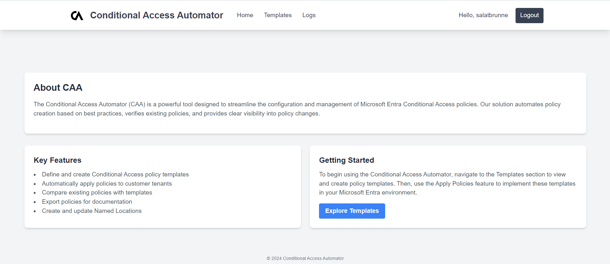
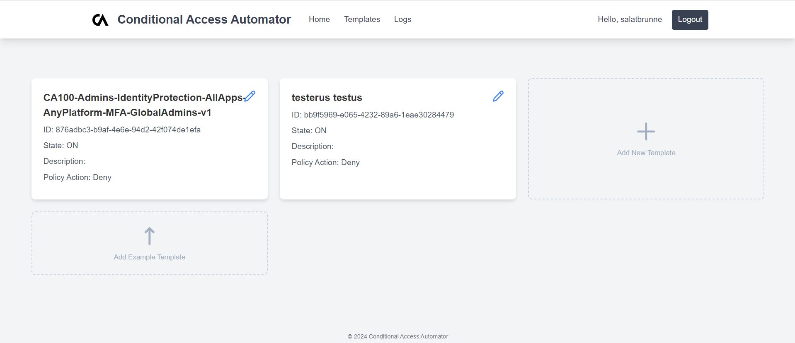
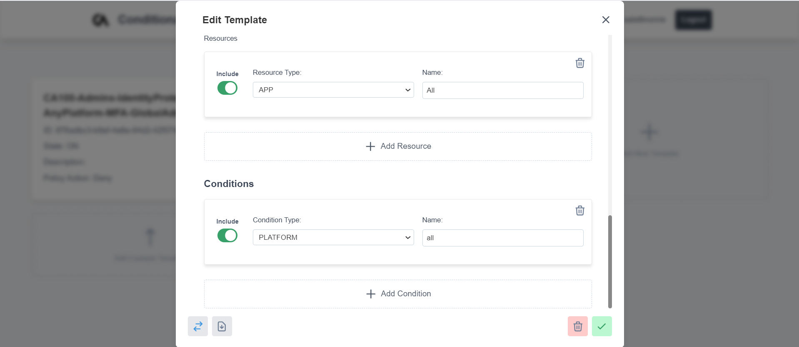
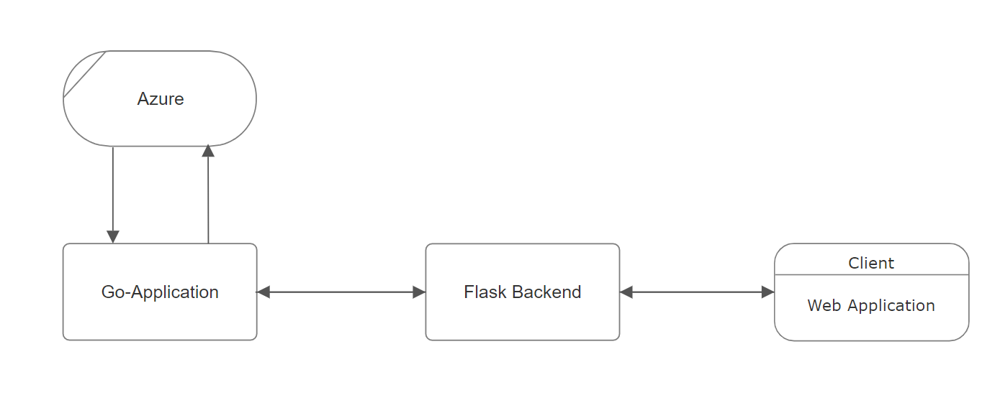

# Conditional Access Automator

## About CAA
The Conditional Access Automator (CAA) is a powerful tool designed to streamline the configuration and management of Microsoft Entra Conditional Access policies. Our solution automates policy creation based on best practices, verifies existing policies, and provides clear visibility into policy changes.


## Key Features
- Define and create Conditional Access policy templates
- Automatically apply policies to customer tenants
- Compare existing policies with templates
- Export policies for documentation
- Quickly apply many policies to different tenants







## Setup
The tool can be directly executed with `python` and `go`:

```bash
cd web
# Configure the python app with environemt variables (see 'web/.env.example')
pip install -r requirements.txt
python3 app.py 5000
```
```bash
cd server
go run main.go :5001 <AzureEmergencyAccountId>
```

You can also build standalone executables:

```bash
cd web
pip install -r requirements.txt
pyinstaller --onefile --add-data "templates:templates" --add-data "static:static" app.py --name caa_webserver
```
```bash
cd server
go build -o caa_server main.go
```

---
Implemented in 30 hours at Young Talent Hackathon in Lucerne.